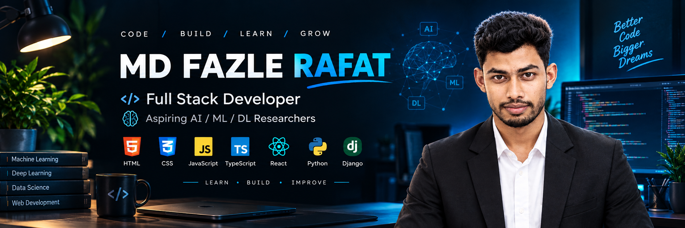

  

<h1 align="center">Hi 👋, I'm MD Fazle Rafat</h1>
<h3 align="center">A passionate frontend developer from Bangladesh</h3>

- 📫 How to reach me **md.fozle.rafat@gmail.com**

<h3 align="left">Connect with me:</h3>

<h3 align="left">Languages and Tools:</h3>

   
       
  
  

  ## 👨‍💻 About Me

I am a **Computer Science and Engineering (CSE) student** with a strong passion for **technology, research, web development, and creative design**.

As a **Web Developer and Graphic Designer**, I enjoy building engaging and functional projects using technologies such as:

- HTML
- CSS
- JavaScript
- TypeScript
- React
- Tailwind CSS
- Canva
- Figma

Alongside my academic journey, I am also actively creating content across multiple platforms. My goal is to **inspire, inform, and raise awareness** on various topics through creative and meaningful content.

---

## 🎬 Content Creation & Projects

### 📖 Storyflair Haider
A platform dedicated to **storytelling and creative content** designed to inspire and engage readers.

- 👉 [Facebook Page](https://www.facebook.com/storyflairhaider)
- 👉 [YouTube Channel](https://www.youtube.com/@StoryflairHaider)

### 📰 Rufftigat
A platform focused on sharing **informative news, articles, and interesting topics**.

- 👉 [Facebook Page](https://www.facebook.com/rufftigat)
- 👉 YouTube Channel

### 🎙️ RufftiTalk
A channel for sharing **knowledge, ideas, and insightful video content**.

- 👉 [YouTube Channel](https://www.youtube.com/@rufftitalk)
- 👉 [Facebook Page](https://www.facebook.com/rufftitalk)

### 🌿 Haider's Natural Paradise
A creative project showcasing the **beauty of nature through photography and videography**.

- 👉 [Facebook Page](https://www.facebook.com/HaidersNaturalParadise)
- 👉 [YouTube Channel](https://www.youtube.com/@mdfozlerafat3981)

---

## 🎯 My Goal

My ultimate goal is not just to build a successful career, but also to **make a positive impact on society through technology, creativity, research, and meaningful content**.

I am continuously working on improving my skills, learning new technologies, and exploring new ideas to become a more capable and innovative person.

I am always open to **collaborating on exciting ideas, projects, and creative initiatives**.

> 🚀 Let's work together to shape the future of technology and innovation!
